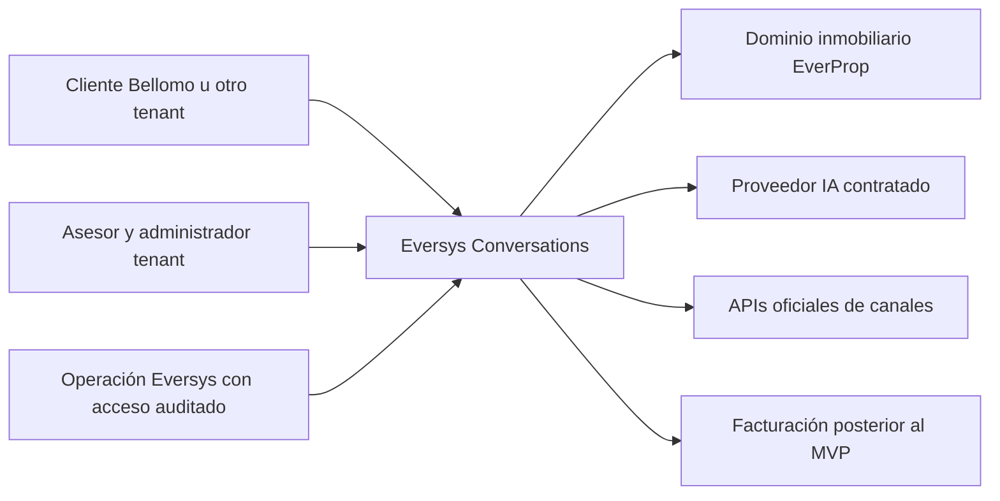
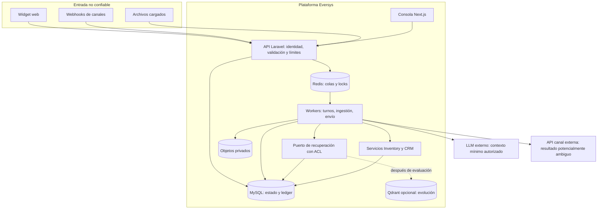
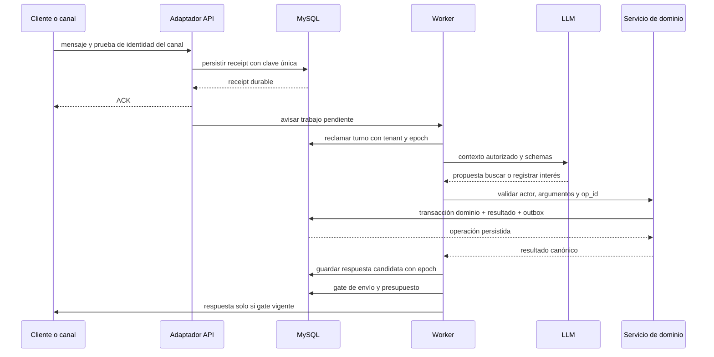
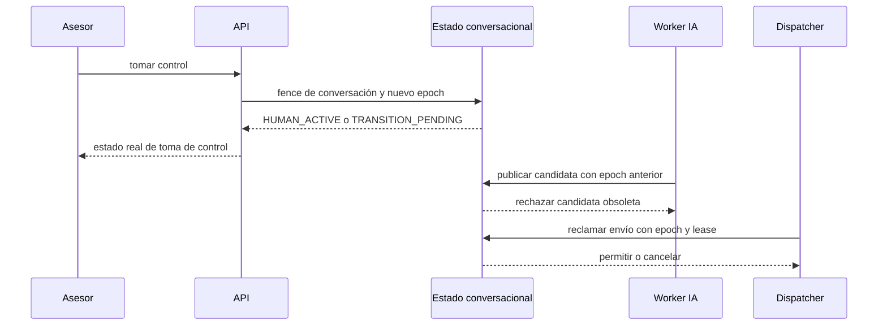

# Arquitectura propuesta — Eversys SaaS IA

Fecha 2026-09-29. Diseño, no implementación. Inspección estática sobre HEAD `1d66246` y archivos locales existentes; no ejecutar ni certificar la aplicación en esta fase.

## Decisión

Extender el monolito modular Laravel de EverProp con núcleo conversacional reusable. Next.js contiene consola Eversys/tenant y widget web; Laravel conserva autorización y escrituras; MySQL es fuente de verdad; Redis distribuye trabajo y cachés, no sustituye persistencia. Workers independientes del proceso HTTP, mismo código y despliegue versionado. **Restricción confirmada: web+WhatsApp en piloto, USD 150/mes**. Recuperación documental inicial con FULLTEXT MySQL, alias curados, filtros y citas detrás de un puerto; no vector store ni reranker de pago en el piloto. La evolución híbrida añade Qdrant y fusión solo cuando calidad y presupuesto lo justifiquen. No añadir PostgreSQL ni framework de agentes obligatorio. Infraestructura y proveedor se contratan recién tras autorización posterior.

Qdrant es candidato técnico de evolución, no servicio existente ni costo comprometido del piloto; su documentación describe consultas híbridas/fusión. La combinación FULLTEXT+vector se integraría en recuperación; no llamar BM25 al FULLTEXT de MySQL. Mantener alternativa Qdrant sparse+dense dentro del mismo puerto. [Qdrant](https://qdrant.tech/documentation/search/hybrid-queries/), consulta 2026-09-29. Si baseline no alcanza gates, reducir corpus/automatización y derivar o renegociar presupuesto: nunca rebajar precisión para cumplir el costo.

## Base actual y correcciones necesarias

| Evidencia local | Reutilizar | Límite |
|---|---|---|
| package.json Next16.2.10/React19.2.4; composer.lock Laravel13.24.0; PHP ^8.4 | Stack conocido y UI | No prueba build ni rendimiento actual |
| Tenancy, Identity, Inventory, CRM, Integrations bajo app/Domain | Contexto confiable, policies y servicios | Endpoints admin no sirven directamente para visitantes públicos |
| Esquema con channel_accounts, conversations, messages, chatbot_agents/sessions/runs, outbound_jobs, domain_outbox | Reconciliar y extender forward-only | Existencia de tablas no acredita bandeja, bot o canal funcionando |
| WebhookReceiver y ProcessWebhookReceipt | Receipt durable, firma genérica, dedupe, outbox | Adaptador de Meta debe verificar protocolo nativo; no asumir compatibilidad |
| LeadDetailView.tsx:263–275 | Ya llama API de visitas en modo API | La afirmación histórica «solo localStorage» está desactualizada; no hay E2E nuevo |
| AdminPropertyController batch/UpdatePropertyRequest y CRM | Resolver con policies existentes | Riesgos estáticos de precios/publicación/identidad repetida; ver contratos |
| NEXT_PUBLIC_EVERPROP_TENANT con default bellomo | Referencia de UI actual | En producción tenant resuelto en servidor; eliminar dependencia de build por cliente |

El esquema y contratos exactos están en [data-and-contracts.md](data-and-contracts.md). No crear tablas paralelas por ignorar baseline. No modificar el baseline SQL.

## Alternativas ponderadas

Escala 1–5, 5 favorable. Puntajes de diseño sujetos a capacidad real del equipo.

| Criterio | Peso | A: ampliar modular | B: plataforma separada | C: base ajena + extensiones |
|---|---:|---:|---:|---:|
| Tiempo a recorrido Bellomo | 25% | 5 | 2 | 4 |
| Reutilización y coherencia permisos | 25% | 5 | 3 | 2 |
| Reutilización SaaS futura | 20% | 4 | 5 | 3 |
| Costo operativo/capacidad equipo | 15% | 4 | 2 | 3 |
| Control y dependencia proveedor | 15% | 5 | 5 | 2 |
| Total ponderado | 100% | 4.65 | 3.30 | 2.85 |

A gana para este punto de partida, no universalmente. B facilita equipos y escalado independientes a costo de identidad distribuida, contratos y transacciones remotas. C acelera bandeja, pero requiere integración CRM, revisar licencia/edición, actualizaciones y controlar dos fuentes de verdad. Chatwoot CE es alternativa real a evaluar si bandeja consume el cronograma; no asumir derechos enterprise. Ver research.md.

Extraer núcleo a servicio separado si varias verticales y equipos requieren ciclos independientes, si aislamiento dedicado contractual lo obliga o si profiling demuestra que workers independientes no bastan. La cantidad de usuarios por sí sola no determina microservicios.

## C4: contexto

## C4: contenedores y confianza

Límite público: cookies/session token y origen permitido para widget no autentican una persona de CRM; sesión visitante solo ve conversación propia. Límite proveedor: validar firma y asociación cuenta→tenant antes de normalizar evento. Límite IA: salida se valida como propuesta, nunca autoridad. El índice vectorial no está expuesto a navegador ni modelo y no decide permisos.

## Módulos

- Identity/Tenancy existentes: contexto request/job, usuarios, scopes, acceso plataforma auditado. Tenant=current organización; usuarios separados por tenant inicialmente. No segundo RBAC.
- Conversations: mensajes, turnos, asignación, notas internas, estados y fencing. Canales no conocen lógica inmobiliaria.
- Integrations: adaptadores web/Meta, receipts, normalización, outbox y entrega. Extraer interfaces de lo existente sin reescribir recepción probada gratuitamente.
- AgentRuntime: config/prompt versionados, presupuesto, herramientas, trazas y estado de ejecución. Sin SQL arbitrario, shell ni navegación abierta.
- Knowledge: ingestión, aprobación, metadatos, chunking, índices derivados y citas.
- Inventory/CRM: fuente de verdad de propiedades/intereses/visitas. Puerto de herramientas usa servicios de aplicación con actor autorizado, no controladores ni cookies de administrador.
- Entitlements/Usage: planes versionados, medición append-only, reserva de presupuesto y conciliación de consumo. Onboarding y factura manual inicial, límites reales desde MVP.

## Recorrido inbound y herramientas

El reconciliador detecta receipts/outbox durables sin job en Redis. Reiniciar Redis no pierde el trabajo de negocio. Idempotencia de herramientas por tenant+operación+clave y hash del payload; payload distinto con clave igual es 409. Para procedimientos legacy que manejan su propia transacción, respetar su límite; no envolverlos ciegamente en una nueva transacción.

## Handoff y carrera de envío

Publicación y toma de control comparten gate serializado por conversación. No mantener transacción SQL durante inferencia LLM. El dispatcher reclama envío mediante lease durable y valida epoch; la toma de control invalida envíos pendientes. Si envío está en vuelo, marcar transición pendiente hasta resolver aceptación/rechazo/timeout. La UI solo afirma control confirmado cuando el protocolo lo permita. No puede deshacer bytes ya enviados al proveedor. Ante timeout ambiguo, marcar UNKNOWN, reconciliar por ID/capacidad del canal y notificar al asesor; no reintentar ciegamente ni garantizar exactly-once externo. Sin reconciliación posible y sin llamada local en curso, resolución manual auditada UNKNOWN_FINAL libera control humano con advertencia de entrega tardía; nunca autoriza replay automático. Un ACK de proveedor no implica entregado. Detalles y pruebas adversariales: evaluation-and-security.md.

## IA y RAG elegidos

Un coordinador, flujo acotado: clasificar → obtener evidencia → ejecutar herramienta autorizada si corresponde → componer → validar → enviar/derivar. No hay enjambre de agentes en runtime. Los especialistas de esta investigación no representan procesos obligatorios del producto.

| Variante | Decisión y prueba |
|---|---|
| Baseline lexical + documentos aprobados | Arquitectura piloto por USD 150; medir y limitar respuestas a evidencia suficiente |
| Vector + léxico + fusión | Evolución por español natural y códigos exactos si supera baseline/costo; filtros duros para IDs/proyecto |
| Reranking | Habilitar si mejora calidad en dataset sin romper p95/costo |
| Contextual retrieval | Ensayar al perder identidad de proyecto/etapa en chunks; no reemplaza metadatos/ACL |
| API estructurada | Obligatoria para datos vigentes; no reconstruir precios desde PDF |
| Agentic RAG abierto | Diferir; máximo de pasos y fuentes cerradas para MVP |
| GraphRAG | Diferir; no existe necesidad validada de consultas globales de grafos |

Fuentes de patrones, consultadas 2026-09-29: [Anthropic contextual retrieval](https://www.anthropic.com/engineering/contextual-retrieval), [Glean indexed/live](https://docs.glean.com/connectors/connectors-power-glean), [GraphRAG](https://www.microsoft.com/en-us/research/project/graphrag/). Son referencias, no evidencia de que Darwin use estas tecnologías.

Ingestión: archivo en cuarentena → validación MIME/tamaño y malware → extracción limitada → revisión/aprobación humana → documento/versiones → chunks con tenant, audience, proyecto, ACL, vigencia, checksum y fuente → índice derivado. Mantener texto canónico en SQL/objetos, vector store reconstruible. Excluir notas internas de corpus público. Revocación deshabilita documento canónico inmediatamente, luego elimina índices/cachés asíncronos; reautorizar hits antes de exponer texto o invocar LLM. Rechequear versión de permisos antes de enviar; si cambió, regenerar o derivar. Datos ya transmitidos a proveedor externo no pueden recuperarse: minimizar y acordar tratamiento antes del piloto.

Recuperación piloto: hasta 10 candidatos léxicos ya filtrados por tenant/audience/vigencia, seleccionar hasta 4 chunks con máximo 3k tokens de evidencia. Alias por proyecto y vocabulario inmobiliario curados; aclarar si no hay resultados suficientes. Evolución: 30 léxicos+30 vectoriales, fusión y reranker opcional hasta 8 chunks/8k tokens. Valores ajustables por evaluación, no benchmarks alcanzados. No usar top-k global y filtrar tenant al final como único aislamiento. Códigos se resuelven exactos por API.

Memoria: mensajes canónicos, resumen versionado y campos declarados por el cliente separados. Cada preferencia guarda origen y fecha; corrección invalida resumen antiguo. No memorizar secretos, inferencias sensibles ni instrucciones del usuario como políticas. Resumen no autoriza acciones. Política propuesta: conversaciones/adjuntos 90 días, payload webhook 30, logs operativos 30, auditoría 365 y backups 35; confirmar con responsable de privacidad antes de producción. Datos CRM siguen política propia. Ver seguridad para borrado/restauración.

Límites piloto: hasta 2 llamadas LLM/turno normal y 3 incluyendo un reintento; 2 lecturas y 1 mutación confirmada; 20s total; 8k tokens entrada y 600 salida por llamada. La reserva presupuestaria considera el máximo configurado, no el promedio económico. Aclarar/derivar al agotarse; recepción y bandeja humana siguen operativas, envíos humanos sujetos a política/cuota del canal. Sin failover que reenvíe PII a proveedor no aprobado. IDs de modelo/prompt/config se fijan y evalúan antes de actualizar.

## Tenant y operación

DB compartida con tenant_id, FK compuestas, queries explícitas y policies; MySQL no aporta aquí RLS automática. Job lleva tenant desde receipt confiable y limpia contexto en finally. Índices/locks/cache/objetos incluyen tenant y versión relevante. Workers por cola y cuotas previenen que un cliente monopolice capacidad. Dedicación por cliente contractual se evalúa como plan separado, no promesa de MVP.

Web MVP puede usar eventos SSE desde Laravel o polling incremental corto si capacidad de hosting impide conexiones persistentes; decisión de transporte tras prueba, no retener worker PHP por cada conexión sin dimensionar. Mensajes deben ser durables antes de notificar UI. No añadir Redis Pub/Sub como única fuente de replay.

Operación propuesta: builds reproducibles; CI raíz para frontend/backend; release por flag tenant; migraciones forward-only y rollback de app compatible; cola de inferencia separada de entrega/ingestión; métricas de cola y dead-letter. SLO/RPO/RTO y pruebas están en seguridad; costos no suponen HA contratada. No se validaron cuentas Railway/Vercel ni región actuales.

## Decisiones abiertas acotadas

Canales decididos: ambos; presupuesto decidido: USD 150 operación, con trabajo humano separado explícitamente. Pendientes: disponibilidad Meta; volumen real; capacidad equipo; contenido público vs interno; modelo/proveedor/región aprobados; confirmación de agenda; plan comercial. Tienen responsable Alvaro/Tech Lead y gate en backlog. La recomendación técnica es base de implementación, no aprobación implícita para operar con datos reales.
